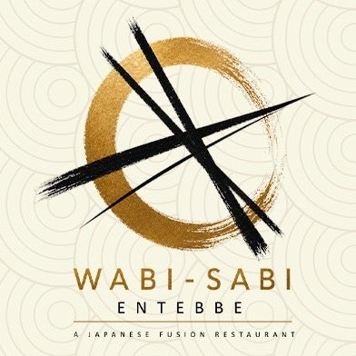

# Brand Identity — Wabi-Sabi Entebbe

> The richest brand artifact we have is the logo (`assets/brand-hero.jpeg`). This document
> reads it closely and connects it to the *wabi-sabi* philosophy the brand is named for. It is
> the **bridge** from the knowledge base to the [design system](../design-system/).
> Last updated: **2026-06-15**.

---

## 1. The name — what "wabi-sabi" means

*Wabi-sabi* (侘寂) is the Japanese aesthetic worldview that finds beauty in **imperfection,
impermanence, and incompleteness**. Its hallmarks: natural materials, asymmetry, simplicity
(*kanso*), understatement, weathered texture, and the quiet dignity of the handmade. A cracked
tea bowl mended with gold (*kintsugi*) is the canonical image — the flaw becomes the feature.

This is not decorative branding; it is a **design brief encoded in the name**. Every design
decision should be testable against it: *Does this feel calm, natural, handmade, unforced?*

---

## 2. Logo anatomy

| Element | Description | Brand meaning |
|---|---|---|
| **Ensō** | A golden Zen brush-circle, open and uneven | Imperfection, the single mindful gesture, wholeness-in-incompleteness |
| **Sumi strokes** | Black brush-strokes crossing the circle (read as chopsticks / calligraphy) | Japanese cuisine + handmade energy; asymmetry |
| **Wordmark** | `WABI-SABI` in wide letter-spaced gold capitals | Refined, editorial, quietly luxurious |
| **Sub-mark** | `ENTEBBE` (spaced caps) + `A JAPANESE FUSION RESTAURANT` | Place + proposition |
| **Ground** | Warm ivory with a faint tone-on-tone **seigaiha** (concentric ripples) | Washi paper; water (Lake Victoria); calm |

**Design takeaways:** generous negative space (*ma*), asymmetry as a feature, a single confident
accent (gold) against warm neutral and ink, and an obviously **hand-brushed** quality. Avoid
crispness, gloss, and symmetry.

---

## 3. Colour — sampled from the logo

Values below were sampled programmatically from the logo file (not eyeballed). See the design
system for the full token set; these are the **anchors**.

| Swatch | Hex | Sampled as | Role |
|---|---|---|---|
| Washi Ivory | `#F2EFE0` | `#F0F0E0` (58% of pixels) | Primary background |
| Sumi Ink | `#16150F` | `#000000`–`#101010` | Text / strokes / near-black |
| Antique Brass (deep) | `#8A5E14` | `#906010` | Deep gold |
| Antique Brass (core) | `#B98A3C` | between `#906010` & `#C09040` | **Primary accent** (the ensō) |
| Champagne Gold | `#C7A576` | `#C0A070` | Light gold / highlights |
| Warm Stone | `#C9BFA6` | `#D0C0A0` / `#C0C0B0` | Neutral surfaces, borders |

The palette is **earthy, warm, and low-contrast by nature** — true to wabi-sabi. The single
saturated note is the brass/gold.

---

## 4. Typography (inferred — to be confirmed)

The actual brand fonts are not yet confirmed (the website is locked). From the logo:

- **Display:** the wordmark is an elegant, high-contrast **serif in spaced capitals**. A faithful,
  freely-available stand-in is **Cormorant Garamond** (alt: EB Garamond, Marcellus).
- **Support / UI:** pair with a calm geometric-humanist sans — **Jost** (alt: Inter, Mulish) —
  used in **letter-spaced uppercase** for eyebrows/labels to echo the `ENTEBBE` treatment.

🟡 *Inference — replace with the real typefaces once the website or brand assets are available.*

---

## 5. Motifs & texture (the visual toolkit)

- **Ensō** — hero mark; can frame photos or punctuate sections.
- **Sumi brushstroke** — section dividers, underlines, hover states.
- **Seigaiha ripples** — subtle background texture (very low contrast).
- **Kintsugi gold seam** — a thin gold line/crack motif for emphasis and dividers (imperfection-as-feature).
- **Ma (negative space)** — the most important "asset": let things breathe.
- **Natural texture** — washi paper grain, matte ceramic, wood, stone.

---

## 6. Cuisine & positioning

- **Proposition:** Japanese fusion + sushi bar, inside a refined boutique hotel on Lake Victoria.
- **Kitchen reality (per venue site):** Asian fusion, international favourites, traditional
  dishes, fresh sushi, beautifully plated dinners, handcrafted cocktails, poolside wood-fired pizza.
- **Implied tier:** upscale-casual / refined (hotel-restaurant context, "beautifully plated").
- **Audience (inferred):** hotel guests, Entebbe/Kampala diners seeking an elevated experience,
  travellers near the airport, the date-night / special-occasion crowd.

---

## 7. Brand voice (inferred from identity)

🟡 *Inference, pending real social/website copy.* The identity points to a voice that is:

- **Calm & understated** — few words, lots of space; never shouty.
- **Sensory & present** — focus on texture, light, season, the moment.
- **Refined but warm** — elegant, not stiff; hospitable.
- **Craft-proud** — celebrates imperfection, the handmade, the chef's hand.

**Sample tone:** *"A quiet table by the lake. Sushi at the bar. Time, slowed."*
**Avoid:** hype, exclamation overload, emoji spam, hard-sell, generic "best in town" claims.

---

## 8. Confidence & gaps

- ✅ Verified: logo, sampled palette, tagline, cuisine, ensō/brush motifs, venue tier.
- 🟡 Inferred (labelled): exact typefaces, brand voice specifics, audience.
- ⚠️ Gap: real fonts, real social/website copy, photography style, secondary brand assets.

→ Turn this into buildable assets in [`../design-system/`](../design-system/).
